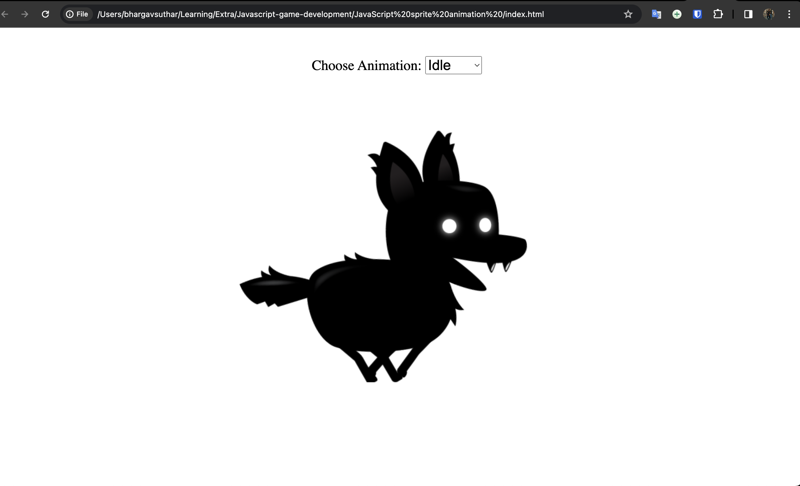
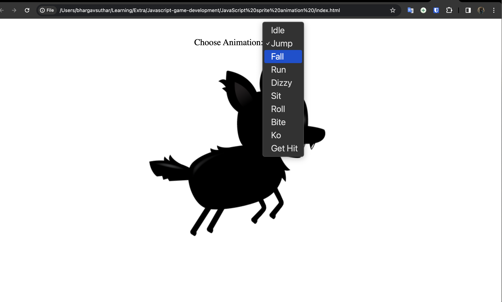

# Javascript-game-development

## Sprite Animation in JS

Sprite animation in JavaScript is like telling a computer to make a little character (sprite) move around on a screen. It's like a sequence of pictures that, when played quickly, create the illusion of movement.

## Reference

[Free Code Camp - JS Gaming Video](https://www.youtube.com/watch?v=GFO_txvwK_c&t=2583s&ab_channel=freeCodeCamp.org)
